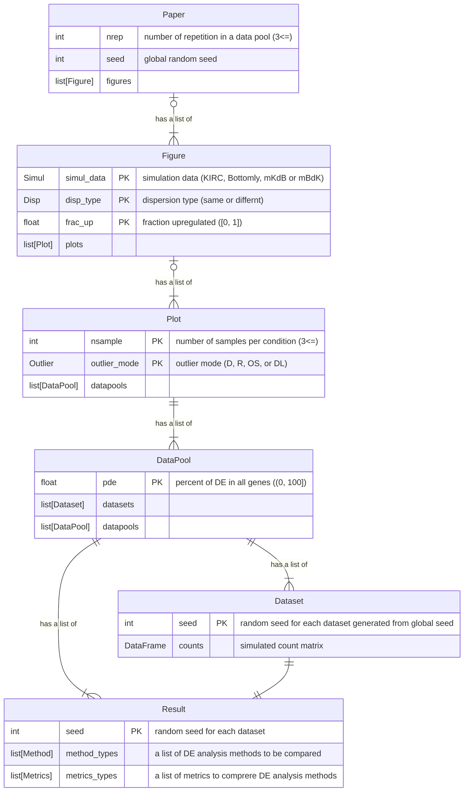

# comPyDEtools

A Python implementation of a part of [compareDEtools](https://github.com/unistbig/compareDEtools).

comPyDEtools can ...

1. Generate simulated dataset (KIRC, Bottomly, mKdB or mBdK)
2. Run DE analysis (using `subprocess.run()`)
3. Generate the figures like [Fig 2 in Baik 2020](https://doi.org/10.1371/journal.pone.0232271.g002)

and can't ...

- SEQC benchmark (like [Fig 1 in Baik 2020](https://doi.org/10.1371/journal.pone.0232271.g001))
- False positive count comparison (like [Fig 3 in Baik 2020](https://doi.org/10.1371/journal.pone.0232271.g003))
- etc

## Installation

```Shell
pip install https://github.com/136s/comPyDEtools.git
```

## Usage

1. Make a condition file like [compydetools/data/synthetic_conditions.yaml](./compydetools/data/synthetic_conditions.yaml).

2. Run

    ```Shell
    python -m compydetools condition.yaml  # specify your condition file made at step 1.
    ```

    or

    <details>
    <summary>run in Python</summary>

    ```python
    from compydetools.condition import CONDITION, set_condition
    from compydetools.core import Paper
    from compydetools.utils import run_commands

    set_condition("condition.yaml")  # specify your condition file made at Usage 1.
    paper = Paper(nrep=CONDITION.nrep)
    paper.generate_datasets()
    for anal_res in run_commands(CONDITION.analysis.cmds):
        print(anal_res)
    paper.make()
    ```

    </details>

3. Check generated files

   - `input/`: simulated RNA-seq data
      - dataset structure
        - first line is header
        - `Gene_ID` column: sequential numbers from 1 to the number of genes
        - `Gene_Symbol` column: "LOC" + `Gene_ID`
        - `Description` column: "up" (upregulated), "dn" (downregulated) or "ns" (not significant)
        - remaining columns: simulated expression counts for each samples and smaple names are "TRT-\*" (treatment sample) or "CTRL-\*" (control sample) (\* is a sequential number for each condition)
      - dataset property
        - file path: `{simul_data}_{disp_type}_upFrac{frac_up}_{nsample}spc_{outlier_mode}_{nde}DE/{simul_data}_{disp_type}_upFrac{frac_up}_{nsample}spc_{outlier_mode}_{nde}DE_rep{seed}.tsv`
        - newline character: LF
        - enxoding: UTF-8
   - `result/`: plots of performance comparison

## condition file (`condition.yaml`)

- `analysis`: configuration of DE analysis
  - `cmds`: a list of DE analysis commands
  - `res`: a reguler expression of a path to result files
    - "{count_stem}" replaced by dataset path stem
    - "{method_type}" replaced by method_type
  - `de_true`: column name of deg regulation (up, dn or ns) in each result files (defaults to "Description")
  - `de_score`: column name of deg score like p-value in each result files (defaults to "padj")
  - `de_score_threshold`: threshold of `de_score` (DEGs' `de_score` is lower than `de_score_threshold`)
- `dirs`: directories of generated files
  - `dataset`: generated simulated datasets
  - `result`: plots of performance comparison, csv of metrics values and pickle of `Paper` instance
- `simul_data`: KIRC, Bottomly, mKdB or mBdK
- `disp_type`: same or differnt
- `frac_up`: fraction upregulated in DEGs (float, $[0, 1]$)
- `nsample`: number of samples per groups (int, 3<=)
- `outlier_mode`: D, R, OS, or DL
- `pde`: percent of DE in all genes (float, $(0, 100]$)
- `metrics_type`: auc, tpr, fdr, cutoff, f1score or kapppa
  - if you want to add any metrics, modify `const.Metrics` and `utils.calc_metrics()` by fork or PR
- `method_type`: specify your DE analysis method (defaults to {"deseq2": "Deseq2"})
  - comPyDEtools recognizes the type of DE analysis method only by the output folder path (`analysis.res` in the condition file)
- `nrep`: number of simulation repetition under one condition (int, $3<=$)

## Development

### Class relationships



### `core` module

- `Paper` class represents all figures in the condition file
- `Figure` class represents a figure (like Fig 2)
- `Plot` class represents a sub figure (like Fig 2A)
- `DataPool` class represents same condtion datasets (contains `nrep` datasets)
- `Dataset` class represents a simulated count matrix
- `Result` class represents a results of a `Dataset` under each method and metrics

|property \| Class|`Paper`|`Figure`|`Plot`|`DataPool`|`Dataset`|`Result`|
|:----|----:|----:|----:|----:|----:|----:|
|a list of|`Figure`|`Plot`|`DataPool`|`Dataset`, `Result`| | |
|number of repetition (`nrep`)|1|1|1|1|||
|simulation data (`simul_data`)| |1|1|1|1|1|
|dispersion type (`disp_type`)| |1|1|1|1|1|
|fraction upregulated (`frac_up`)| |1|1|1|1|1|
|number of samples (`nsample`)| | |1|1|1|1|
|outlier mode (`outlier_mode`)| | |1|1|1|1|
|percent of DE in all genes (`pde`)| | | |1|1|1|
|simulated count matrix| | | | |1|1|
|method type (`method_type`)| | | | | |\*|
|metrics type (`metrics_type`)| | | | | |\*|

Table: Class / property correspondence (\*: many)

### `const` module

- `Simul` class is a list of simulation dataset names
  - `simul_data` in the condition file
- `Disp` class is a list of dispersion condition
  - `disp_type` in the condition file
- `Outlier` class is a list of outlier mode
  - `outlier_mode` in the condition file
- `Metrics` class is a list of metrics of performance comparison
  - `metrics_type` in the condition file
- `Method` class is a list of DE analysis method
  - `method_type` in the condition file

## License

[GPL2.0](https://choosealicense.com/licenses/gpl-2.0/)

This is a partial port of [unistbig/compareDEtools](https://github.com/unistbig/compareDEtools).
